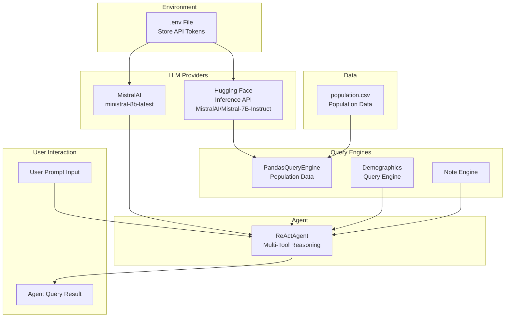

# AskAtlas AI Agent 

## Overview

AskAtlas is an intelligent AI agent designed to provide comprehensive insights into global population and demographic data. Leveraging advanced language models and query engines, AskAtlas can answer complex questions about world populations, demographics, and related information.


##  Architecture



##  Features

- Multi-tool AI reasoning with ReAct Agent architecture
- Query population data from CSV sources
- Integrate multiple query engines (population, demographics)
- Support for advanced language models
- Flexible and extensible design

##  Technologies

- Python
- LlamaIndex
- Pandas
- Hugging Face Inference API
- MistralAI Language Models
- Dotenv for environment management

##  Prerequisites

- Python 3.8+
- Hugging Face Account
- MistralAI API Token
- pip package manager

## 🔧 Installation

1. Clone the repository:
```bash
git clone https://github.com/yourusername/AskAtlas.git
cd AskAtlas
```

2. Create a virtual environment:
```bash
python -m venv venv
source venv/bin/activate  # On Windows, use `venv\Scripts\activate`
```

3. Install dependencies:
```bash
pip install -r requirements.txt
```

4. Create a `.env` file with your tokens:
```
HF_TOKEN=your_hugging_face_token
MISTRAL_TOKEN=your_mistral_api_token
```

##  Usage

Run the AI agent:
```bash
python main.py
```

Example interactions:
```
Enter a prompt (q to quit): What is the population of China?
Enter a prompt (q to quit): Compare population growth between India and Brazil
Enter a prompt (q to quit): q  # to exit
```

##  Components

- **Population Query Engine**: Analyzes population data from CSV
- **Demographics Engine**: Provides demographic insights
- **Note Engine**: Adds contextual information
- **ReAct Agent**: Intelligently routes and answers queries

##  Configuration

Modify `main.py` to:
- Change language models
- Add more query engines
- Customize agent behavior

## Data Sources

- `data/population.csv`: Primary population dataset

## 🤝 Contributing

1. Fork the repository
2. Create your feature branch (`git checkout -b feature/AmazingFeature`)
3. Commit your changes (`git commit -m 'Add some AmazingFeature'`)
4. Push to the branch (`git push origin feature/AmazingFeature`)
5. Open a Pull Request


## License

This project is open source and available under the [MIT License](LICENSE).

## Author

This project is created and maintained by [Ankit Mishra](https://ankitmishra.live/).

You can find my GitHub profile here: [@ankitmishralive](https://github.com/your-github-id).
